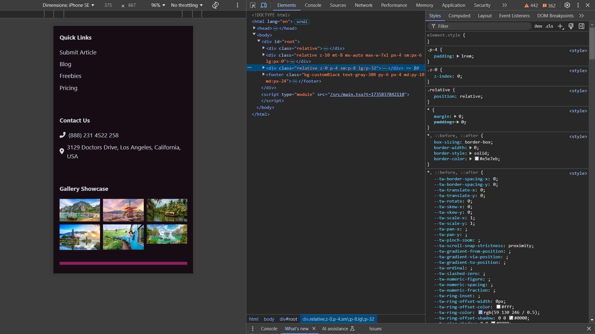
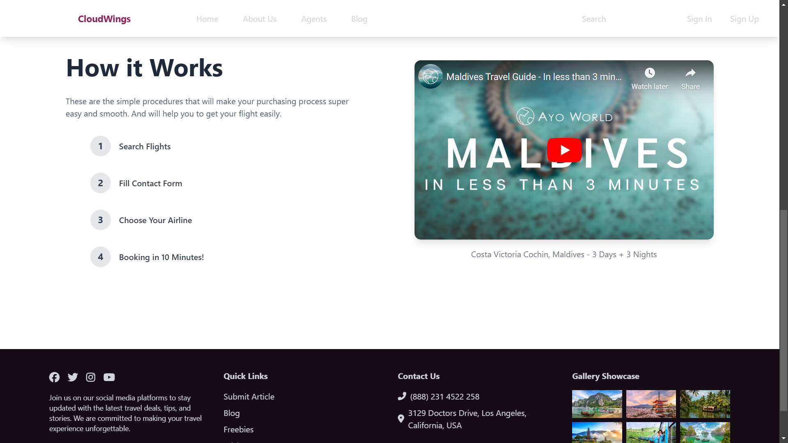

# CloudWings

CloudWings is a travel booking application that allows users to search for flights, view travel deals, and book flights easily.

## Table of Contents

- [Description](#description)
- [Technologies Used](#technologies-used)
- [Installation](#installation)
- [Usage](#usage)

## Description

CloudWings is a modern web application designed to simplify the process of booking flights. Users can search for flights, view travel deals, and book flights with ease. The application features a responsive design, ensuring a seamless experience across different devices.

### Screenshots

#### Mobile View




#### Web View




## Technologies Used

- **React**: A JavaScript library for building user interfaces.
- **Tailwind CSS**: A utility-first CSS framework for rapid UI development.
- **Radix UI**: A set of low-level, accessible UI components for building high-quality design systems and web apps.
- **React Icons**: A collection of popular icons for React applications.
- **Vite**: A fast build tool and development server for modern web projects.
- **TypeScript**: A typed superset of JavaScript that compiles to plain JavaScript.
- **shadcn**: A set of components built with Tailwind CSS and Radix UI for building modern web applications.

## Installation

To get started with the project, follow these steps:

1. **Clone the repository:**

    ```bash
    git clone https://github.com/chamathishanka/cloud-wings.git
    cd cloud-wings
    ```

2. **Install dependencies:**

    Make sure you have [Node.js](https://nodejs.org/) installed. Then, install the project dependencies using npm or yarn:

    ```bash
    npm install
    # or
    yarn install
    ```

    This will install all the necessary dependencies listed in the [package.json](http://_vscodecontentref_/1) file, including Tailwind CSS, Radix UI, React Icons, shadcn, and other packages.

3. **Start the development server:**

    ```bash
    npm run dev
    # or
    yarn dev
    ```

    This will start the development server and open the application in your default browser.

## Usage

Once the development server is running, you can access the application at `http://localhost:3000`. You can then use the application to search for flights, view travel deals, and book flights.


